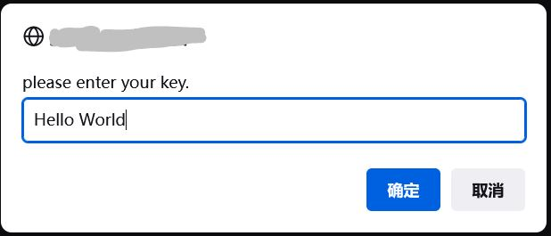
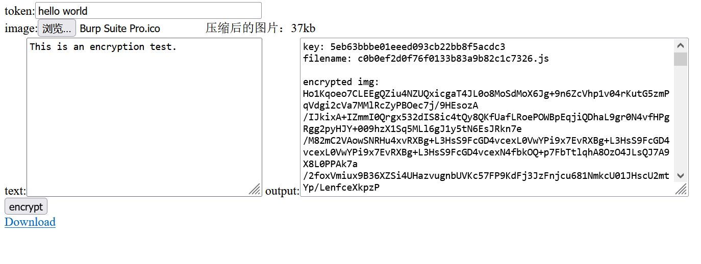
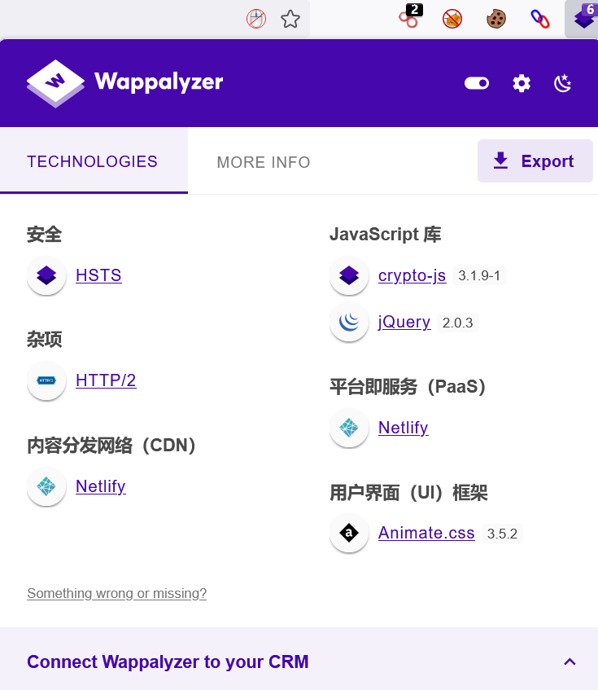
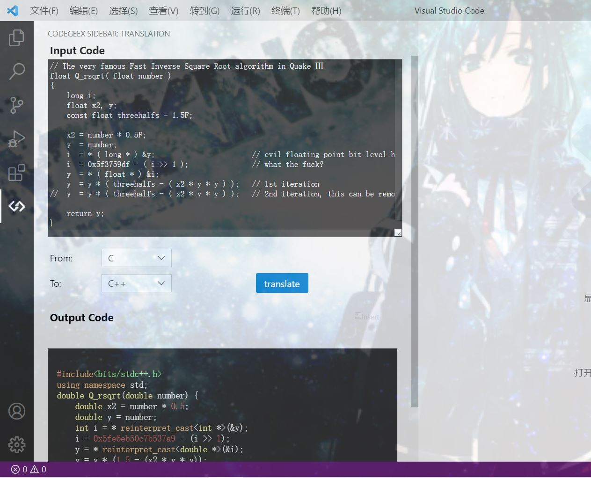
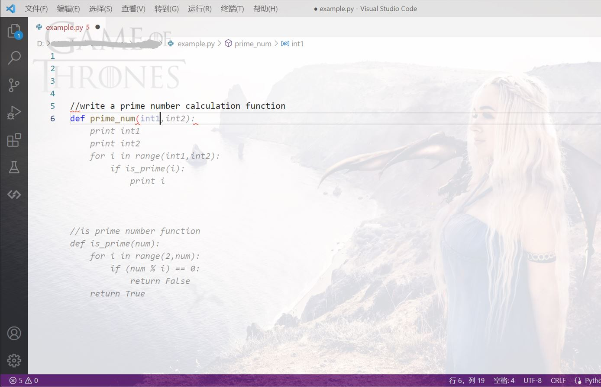

# GCards
```console
   ____    ____                     _       
  / ___|  / ___|   __ _   _ __   __| |  ___ 
 | |  _  | |      / _` | | '__| / _` | / __|
 | |_| | | |___  | (_| | | |   | (_| | \__ \
  \____|  \____|  \__,_| |_|    \__,_| |___/

```
is a multi-user gift card project based on static webpage and [Netlify](https://github.com/netlify).
> &ensp; a substitute for Github Pages
------------
If you come to this page from the GCards, it means you are a lucky friend of mine, and has received a gift card specially designed for you.

------------

## Details


> The first time GCards is used, an alert pops up to enter the token. Or the token can be entered by visiting the site with 'get' params like this:
```console
XXX.com/?token={your token}
```
Then the token is automatially saved to cookie. So next time you visit, no pop-ups, no params, just directly visit the site.


> The beautiful firework written in javascript

-----------


> The mouseclick animation effect

-----------

The UI is copied from github, but I fixed some bugs and upgraded the project into a multi-user one with the token system and des-decryption, so it's rather hard to see others' cards without the token, even though all the source codes are exposed on the internet.


> The DES encryption and md5 token generator.

------------


> All the technologies concerned

------------

## Thanks
A small part of the code is automatically generated by the free and open source AI code assistant [Codegeex](https://github.com/THUDM/Codegeex) developed by Tsinghua University.

Generally speaking, it is a free alternative for github copilot, and has impressive code translation functions.

> Code translation

------------



> AI coding prediction
